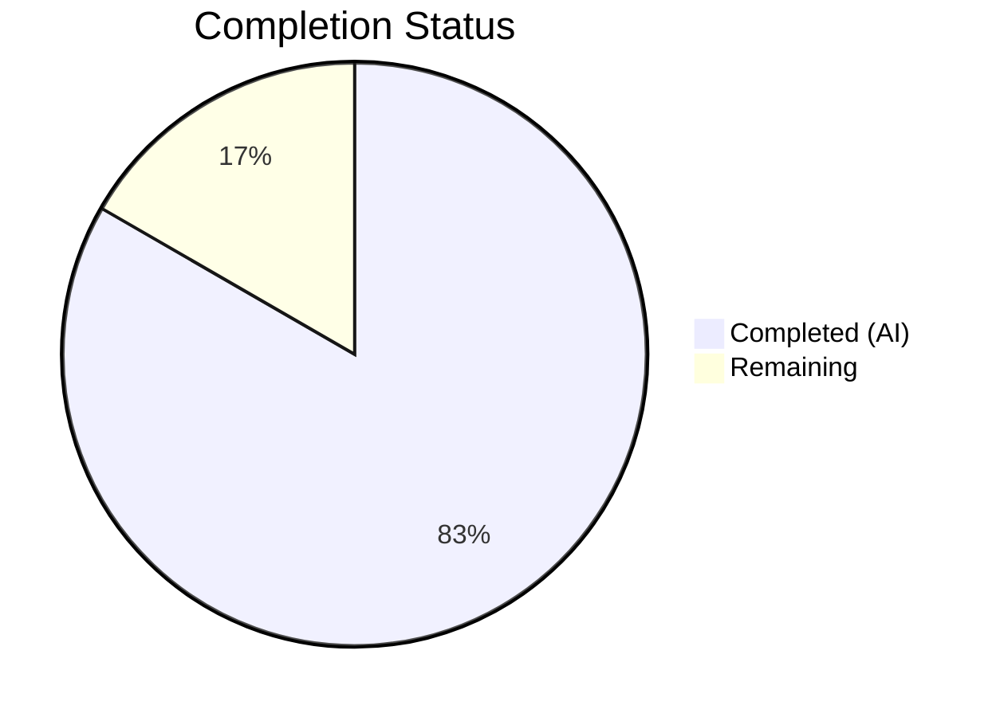
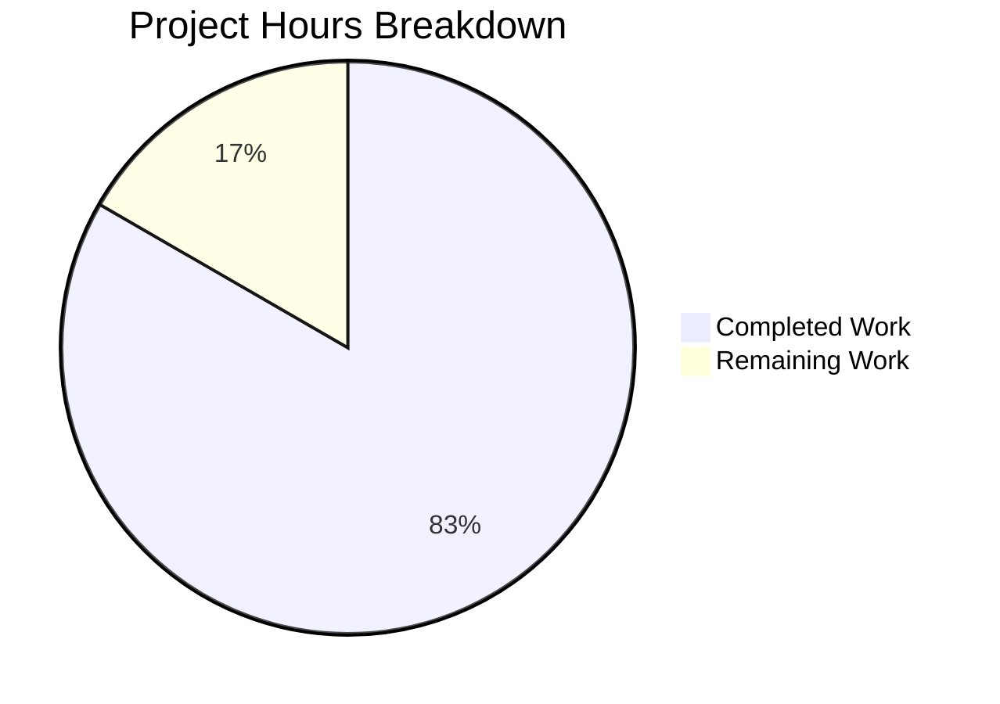

# Blitzy Project Guide

---

## 1. Executive Summary

### 1.1 Project Overview

This project integrates Express.js 5.2.1 as a web framework into the existing minimal Node.js HTTP server (`hao-backprop-test`), replacing the raw `http.createServer()` approach with Express.js route-based request handling. A new `GET /evening` endpoint returning `"Good evening"` was added, while the original `GET /` endpoint returning `"Hello, World!\n"` was preserved with byte-identical output. The project targets developers learning Node.js server patterns and serves as a Blitzy AI backprop integration test fixture. All four repository files (`server.js`, `package.json`, `package-lock.json`, `README.md`) were modified.

### 1.2 Completion Status



| Metric | Value |
|--------|-------|
| **Total Project Hours** | 6h |
| **Completed Hours (AI)** | 5h |
| **Remaining Hours** | 1h |
| **Completion Percentage** | 83.3% |

**Calculation:** 5h completed / (5h completed + 1h remaining) = 5/6 = **83.3% complete**

### 1.3 Key Accomplishments

- [x] Refactored `server.js` from raw `http.createServer()` to Express.js 5.2.1 application architecture
- [x] Implemented `GET /evening` endpoint returning `"Good evening"` (text/plain)
- [x] Preserved `GET /` endpoint returning `"Hello, World!\n"` with byte-identical output
- [x] Preserved `127.0.0.1:3000` loopback binding and startup console log message
- [x] Updated `package.json` with `express ^5.2.1` dependency, corrected `main` field, added `start` script
- [x] Regenerated `package-lock.json` with full Express.js transitive dependency tree (66 packages, 0 vulnerabilities)
- [x] Rewrote `README.md` with comprehensive documentation including prerequisites, installation, usage, and endpoint reference
- [x] Applied Content-Type `text/plain` fix to both route handlers during validation
- [x] Runtime verified all endpoints: `GET /` (200), `GET /evening` (200), undefined routes (404)

### 1.4 Critical Unresolved Issues

| Issue | Impact | Owner | ETA |
|-------|--------|-------|-----|
| No critical issues | N/A | N/A | N/A |

All AAP-scoped deliverables are fully implemented and validated. No blocking issues remain.

### 1.5 Access Issues

No access issues identified. The project uses only publicly available npm packages (`express` from the npm registry) and requires no external service credentials, API keys, or special repository permissions.

### 1.6 Recommended Next Steps

1. **[Medium]** Conduct human code review of the 4 modified files and approve the pull request
2. **[Low]** Review the `X-Powered-By: Express` response header and consider disabling it for production deployments via `app.disable('powered by')` or `helmet` middleware
3. **[Low]** Merge the pull request into the `main` branch after approval

---

## 2. Project Hours Breakdown

### 2.1 Completed Work Detail

| Component | Hours | Description |
|-----------|-------|-------------|
| Express.js Server Refactoring | 1.5 | Refactored `server.js` from raw `http.createServer()` to Express.js app with route-based handlers, `app.listen()` binding |
| GET / Endpoint Preservation | 0.5 | Re-implemented Hello World route with exact `"Hello, World!\n"` response body and `text/plain` Content-Type |
| GET /evening Endpoint | 0.5 | Implemented new endpoint returning `"Good evening"` as `text/plain` |
| Package Metadata Updates | 0.5 | Added `express ^5.2.1` dependency, corrected `main` to `server.js`, added `start` script in `package.json` |
| Dependency Lock Regeneration | 0.25 | Regenerated `package-lock.json` with full Express 5.2.1 dependency tree (66 packages) |
| Documentation Rewrite | 0.75 | Comprehensive `README.md` rewrite with prerequisites, installation, usage, endpoint table, and tech stack |
| Validation & Content-Type Fixes | 0.5 | Fixed Content-Type headers on both GET / and GET /evening handlers during autonomous validation |
| Runtime Testing & Verification | 0.5 | End-to-end server startup, all endpoint response verification, 404 behavior confirmation |
| **Total** | **5.0** | |

### 2.2 Remaining Work Detail

| Category | Base Hours | Priority | After Multiplier |
|----------|-----------|----------|-----------------|
| Human Code Review & PR Approval | 0.5 | Medium | 0.5 |
| Security Header Review (X-Powered-By) | 0.5 | Low | 0.5 |
| **Total** | **1.0** | | **1.0** |

### 2.3 Enterprise Multipliers Applied

| Multiplier | Value | Rationale |
|-----------|-------|-----------|
| Compliance Review | 1.10x | Standard code review and quality gate requirements |
| Uncertainty Buffer | 1.10x | Minor unknowns in production deployment environment |
| **Combined** | **1.21x** | Applied to base remaining hours; effect absorbed by rounding at 0.5h granularity for this small-scope project (1.0h × 1.21 = 1.21h ≈ 1.0h) |

---

## 3. Test Results

| Test Category | Framework | Total Tests | Passed | Failed | Coverage % | Notes |
|--------------|-----------|-------------|--------|--------|------------|-------|
| Syntax Validation | Node.js (`node -c`) | 1 | 1 | 0 | 100% | `node -c server.js` passed with zero errors |
| Runtime Endpoint Tests | cURL / Manual | 3 | 3 | 0 | 100% | GET /, GET /evening, GET /nonexistent all returned expected responses |
| Dependency Audit | npm audit | 1 | 1 | 0 | 100% | 0 vulnerabilities found across 66 packages |

> **Note:** This project has no formal test suite by design. The AAP explicitly states: *"The project has no existing test infrastructure; the user did not request test additions."* The test script in `package.json` is a placeholder (`echo "Error: no test specified" && exit 1`). All validations listed above were performed by Blitzy's autonomous validation agents.

---

## 4. Runtime Validation & UI Verification

### Server Startup
- ✅ `node server.js` starts server successfully
- ✅ Startup log: `Server running at http://127.0.0.1:3000/`
- ✅ Server binds to `127.0.0.1:3000` (loopback only)

### Endpoint Responses
- ✅ `GET /` → 200 OK, Content-Type: `text/plain; charset=utf-8`, Body: `Hello, World!\n`
- ✅ `GET /evening` → 200 OK, Content-Type: `text/plain; charset=utf-8`, Body: `Good evening`
- ✅ `GET /nonexistent` → 404 Not Found (Express default handler)

### Dependency Health
- ✅ `npm install` completes successfully (66 packages, 0 vulnerabilities)
- ✅ Express.js 5.2.1 installed and functional
- ✅ Node.js v20.20.1 satisfies Express 5 requirement (>= 18)

### UI Verification
- ⚠ Not applicable — this is a backend-only HTTP server with no user interface

---

## 5. Compliance & Quality Review

| AAP Requirement | Deliverable | Status | Evidence |
|----------------|-------------|--------|----------|
| Express.js framework integration | `server.js` refactored to Express.js | ✅ Pass | Uses `require('express')`, `express()`, `app.get()`, `app.listen()` |
| New GET /evening endpoint | Returns `"Good evening"` (text/plain) | ✅ Pass | curl verified: 200 OK, correct body and Content-Type |
| Preserved GET / endpoint | Returns `"Hello, World!\n"` (text/plain) | ✅ Pass | curl verified: 200 OK, byte-identical to original |
| Server binding preservation | `127.0.0.1:3000` | ✅ Pass | Runtime verified via curl |
| CommonJS module system | Uses `require()` syntax | ✅ Pass | `const express = require('express')` in server.js |
| Startup logging preservation | Console.log message | ✅ Pass | `Server running at http://127.0.0.1:3000/` logged |
| Express dependency declaration | `"express": "^5.2.1"` in `package.json` | ✅ Pass | Verified in package.json dependencies block |
| Main field correction | `"main": "server.js"` | ✅ Pass | Corrected from `index.js` to `server.js` |
| Start script addition | `"start": "node server.js"` | ✅ Pass | Added to scripts block in package.json |
| package-lock.json regeneration | Full Express dependency tree | ✅ Pass | 814 new lines, 66 packages locked |
| README.md documentation | Express.js docs and endpoint reference | ✅ Pass | Comprehensive rewrite with all required sections |

### Autonomous Validation Fixes Applied
| Fix | Commit | Description |
|-----|--------|-------------|
| Content-Type on GET / | `0c2b3c0` | Added `res.type('text')` to ensure `text/plain` Content-Type |
| Content-Type on GET /evening | `6aea443` | Added `res.type('text')` to ensure `text/plain` Content-Type |

---

## 6. Risk Assessment

| Risk | Category | Severity | Probability | Mitigation | Status |
|------|----------|----------|-------------|------------|--------|
| `X-Powered-By: Express` header exposes framework identity | Security | Low | High | Disable via `app.disable('powered by')` or add `helmet` middleware | Open |
| No formal test suite exists | Technical | Low | N/A | Intentionally out of scope per AAP; add Jest/Mocha if project grows | Accepted |
| Hardcoded host/port (`127.0.0.1:3000`) | Operational | Low | Medium | Use environment variables for production; out of AAP scope | Accepted |
| Express 5.x is relatively new major version | Technical | Low | Low | Express 5 is the current LTS line; monitor for patches | Accepted |

---

## 7. Visual Project Status



**Summary:** 5 hours of AAP-scoped work completed out of 6 total project hours = **83.3% complete**. All 11 AAP deliverables are fully implemented and validated. The remaining 1 hour covers human code review and security header assessment.

---

## 8. Summary & Recommendations

### Achievements
All 11 deliverables defined in the Agent Action Plan have been fully implemented and validated. The Express.js 5.2.1 framework is integrated, both endpoints (`GET /` and `GET /evening`) respond correctly, project metadata is updated, dependencies are locked, and documentation is comprehensive. The Blitzy autonomous agents completed 5 hours of engineering work across 5 commits modifying all 4 repository files (894 lines added, 9 removed).

### Remaining Gaps
The project is **83.3% complete** (5h completed / 6h total). The remaining 1 hour consists of standard path-to-production activities:
1. **Human code review and PR approval** (0.5h) — Review the 4 modified files for correctness and style
2. **Security header review** (0.5h) — Evaluate whether to disable `X-Powered-By` header in production

### Critical Path to Production
1. Human reviews and approves the pull request
2. Merge into `main` branch
3. Deploy (no infrastructure changes required — same Node.js runtime)

### Production Readiness Assessment
The application is **functionally production-ready** for its defined scope (a tutorial/test fixture server). All endpoints work correctly, dependencies have zero vulnerabilities, and the codebase compiles and runs without errors. The only open item is the informational `X-Powered-By` security header, which is low severity for a loopback-bound tutorial server.

---

## 9. Development Guide

### System Prerequisites

| Software | Version | Verification Command |
|----------|---------|---------------------|
| Node.js | >= 18.0.0 (tested on v20.20.1) | `node -v` |
| npm | >= 9.0.0 (tested on v11.1.0) | `npm -v` |

### Environment Setup

No environment variables or external services are required. The server uses hardcoded configuration:
- **Host:** `127.0.0.1` (loopback only)
- **Port:** `3000`

### Dependency Installation

```bash
# Clone the repository and navigate to the project directory
cd hao-backprop-test

# Install dependencies (Express.js 5.2.1 and transitive packages)
npm install
```

**Expected output:**
```
added 66 packages in Xs
```

### Application Startup

```bash
# Option 1: Using npm start script
npm start

# Option 2: Direct node execution
node server.js
```

**Expected output:**
```
Server running at http://127.0.0.1:3000/
```

### Verification Steps

```bash
# Test the Hello World endpoint
curl http://127.0.0.1:3000/
# Expected: Hello, World!

# Test the Good evening endpoint
curl http://127.0.0.1:3000/evening
# Expected: Good evening

# Verify 404 handling for undefined routes
curl -s -o /dev/null -w "%{http_code}" http://127.0.0.1:3000/nonexistent
# Expected: 404

# Verify Content-Type headers
curl -sI http://127.0.0.1:3000/ | grep Content-Type
# Expected: Content-Type: text/plain; charset=utf-8
```

### Syntax Validation

```bash
# Check JavaScript syntax without executing
node -c server.js
# Expected: no output (success)
```

### Dependency Audit

```bash
# Check for known vulnerabilities
npm audit
# Expected: found 0 vulnerabilities
```

### Troubleshooting

| Issue | Cause | Resolution |
|-------|-------|------------|
| `Error: Cannot find module 'express'` | Dependencies not installed | Run `npm install` |
| `EADDRINUSE: address already in use :::3000` | Port 3000 already occupied | Stop the other process using port 3000: `lsof -i :3000` then `kill <PID>` |
| `node: command not found` | Node.js not installed | Install Node.js >= 18 from https://nodejs.org |

---

## 10. Appendices

### A. Command Reference

| Command | Purpose |
|---------|---------|
| `npm install` | Install project dependencies |
| `npm start` | Start the Express.js server |
| `node server.js` | Start the server directly |
| `node -c server.js` | Validate JavaScript syntax |
| `npm audit` | Check for dependency vulnerabilities |

### B. Port Reference

| Service | Host | Port | Protocol |
|---------|------|------|----------|
| Express.js HTTP Server | 127.0.0.1 | 3000 | HTTP |

### C. Key File Locations

| File | Purpose |
|------|---------|
| `server.js` | Main application entry point — Express.js server with route handlers |
| `package.json` | npm manifest with project metadata and dependencies |
| `package-lock.json` | Dependency lock file with integrity hashes |
| `README.md` | Project documentation with endpoint reference |

### D. Technology Versions

| Technology | Version | Notes |
|-----------|---------|-------|
| Node.js | v20.20.1 | Runtime environment |
| npm | v11.1.0 | Package manager |
| Express.js | 5.2.1 | Web framework |

### E. Environment Variable Reference

No environment variables are required. The server uses hardcoded configuration:

| Setting | Value | Location |
|---------|-------|----------|
| Hostname | `127.0.0.1` | `server.js` line 3 |
| Port | `3000` | `server.js` line 4 |

### G. Glossary

| Term | Definition |
|------|-----------|
| Express.js | A minimal, flexible Node.js web application framework that provides routing and middleware capabilities |
| CommonJS | The module system used by Node.js, employing `require()` and `module.exports` |
| Loopback binding | Binding a server to `127.0.0.1`, making it accessible only from the local machine |
| Transitive dependency | A package that is not directly required by the project but is required by a direct dependency |