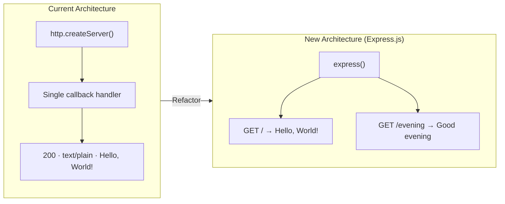

# Technical Specification

# 0. Agent Action Plan

## 0.1 Intent Clarification


### 0.1.1 Core Feature Objective

Based on the prompt, the Blitzy platform understands that the new feature requirement is to:

- **Integrate Express.js as a web framework** into the existing minimal Node.js HTTP server project (`hao-backprop-test`), replacing the current raw `http.createServer()` approach with Express.js route-based request handling.
- **Add a new HTTP endpoint** that responds with the plain-text string `"Good evening"` when accessed.
- **Preserve the existing "Hello world" behavior** by re-implementing the current catch-all `Hello, World!` response as a dedicated Express.js route.

The implicit requirements detected from this request are:

- The project must transition from a zero-dependency, raw `http` module architecture to an Express.js-based architecture, which fundamentally changes the dependency posture of the project.
- The existing `server.js` file must be refactored to use Express.js idioms (app instantiation, route registration, `app.listen()`), while preserving the current host (`127.0.0.1`) and port (`3000`) binding.
- The `package.json` manifest must be updated to declare `express` as a runtime dependency, and `package-lock.json` will be regenerated to reflect the new dependency tree.
- The `main` field in `package.json` (currently pointing to the non-existent `index.js`) should be corrected to reference `server.js`, since this is the actual entry point.

### 0.1.2 Special Instructions and Constraints

- **No specific architectural directives were provided by the user.** The request is straightforward: add Express.js and a new endpoint.
- **Backward compatibility consideration:** The existing `Hello, World!` response must remain accessible. The user's prompt describes this as "a tutorial of node js server hosting one endpoint that returns the response 'Hello world'", confirming the current endpoint behavior must be preserved.
- **No Figma designs, authentication integrations, or performance constraints were specified.**
- **No environment variables, secrets, or custom setup instructions were provided.**

### 0.1.3 Technical Interpretation

These feature requirements translate to the following technical implementation strategy:

- To **integrate Express.js**, we will install `express` (version `5.2.1`, the latest stable release on npm) as a runtime dependency and refactor `server.js` to replace `http.createServer()` with an Express application instance.
- To **add the "Good evening" endpoint**, we will register a new Express route (e.g., `GET /evening`) that responds with the plain-text string `"Good evening"`.
- To **preserve the "Hello world" endpoint**, we will register an Express route (e.g., `GET /`) that responds with `"Hello, World!\n"`, maintaining byte-identical output with the current implementation.
- To **maintain server binding**, we will use `app.listen(3000, '127.0.0.1', callback)` to preserve the existing loopback-only binding on port `3000`.
- To **update project metadata**, we will modify `package.json` to include `express` in `dependencies` and correct the `main` field to `server.js`. We will also add a `start` script for convenient server launch.


## 0.2 Repository Scope Discovery


### 0.2.1 Comprehensive File Analysis

The repository is a minimal, flat Node.js project with exactly four files at the root level and no subdirectories. Every file in the repository is affected by this feature addition.

**Existing Files Requiring Modification:**

| File | Current Purpose | Required Modification |
|------|----------------|----------------------|
| `server.js` | 14-line HTTP server using raw `http.createServer()` bound to `127.0.0.1:3000`; responds with `Hello, World!\n` to all requests | Refactor entirely to use Express.js: replace `require('http')` with `require('express')`, create Express app instance, register route `GET /` for "Hello, World!" response, register route `GET /evening` for "Good evening" response, use `app.listen()` for binding |
| `package.json` | npm manifest with zero dependencies; `main` points to non-existent `index.js`; placeholder `test` script | Add `express` to `dependencies`, correct `main` field from `index.js` to `server.js`, add `start` script (`node server.js`) |
| `package-lock.json` | Structural attestation of zero dependencies (lockfileVersion 3) | Will be regenerated automatically by `npm install` to include `express` and all its transitive dependencies |
| `README.md` | Two-line file with project title and "Do not touch!!!" directive | Update to document the new Express.js-based architecture and the available endpoints (`/` and `/evening`) |

**Integration Point Discovery:**

| Integration Point | Details |
|-------------------|---------|
| HTTP request routing | Currently non-existent (all requests get same response); Express.js will introduce path-based routing with `GET /` and `GET /evening` |
| Server instantiation | Currently `http.createServer(callback)`; will become `express()` app factory |
| Network binding | Currently `server.listen(port, hostname, cb)`; will become `app.listen(port, hostname, cb)` |
| Module system | Currently CommonJS with `require('http')`; will use `require('express')` |

### 0.2.2 Web Search Research Conducted

- **Express.js version and compatibility:** Confirmed that Express.js `5.2.1` is the latest stable release on npm. Express 5 requires Node.js >= 18, which is satisfied by the current environment (Node.js v20.20.1).
- **Express 5 routing patterns:** Express 5 uses the standard `app.get(path, handler)` pattern for route registration. The `res.send()` method handles plain-text responses natively.
- **Express 5 breaking changes from v4:** Updated `path-to-regexp`, removed legacy APIs, automatic promise rejection handling in async middleware. These changes do not affect this simple implementation.

### 0.2.3 New File Requirements

No new source files need to be created for this feature. The entire implementation can be achieved by modifying the existing `server.js`. The repository's minimal, single-file architecture is preserved.

| Category | Files | Justification |
|----------|-------|---------------|
| New source files | None | Express.js integration and the new endpoint fit naturally within the existing `server.js` |
| New test files | None | The project has no existing test infrastructure; the user did not request test additions |
| New configuration files | None | No environment-specific configuration is needed; Express.js works with the existing `package.json` manifest |


## 0.3 Dependency Inventory


### 0.3.1 Private and Public Packages

The project currently has zero dependencies. This feature addition introduces one new public package and its transitive dependency tree.

| Registry | Package Name | Version | Purpose | Status |
|----------|-------------|---------|---------|--------|
| npm (public) | `express` | `5.2.1` | Minimalist web framework for Node.js; provides routing, middleware, and HTTP utility methods | To be added as a runtime `dependency` |

**Transitive Dependencies:** Express 5.2.1 includes a curated set of transitive dependencies (e.g., `body-parser`, `content-disposition`, `cookie`, `debug`, `finalhandler`, `path-to-regexp`, `qs`, `send`, `serve-static`, among others). These will be automatically resolved and locked by `npm install` in the regenerated `package-lock.json`.

**Runtime Requirement:** Express 5 requires Node.js >= 18. The current environment runs Node.js v20.20.1, which satisfies this requirement.

### 0.3.2 Dependency Updates

**Import Updates:**

| File Pattern | Current Import | New Import |
|-------------|---------------|------------|
| `server.js` | `const http = require('http');` | `const express = require('express');` |

**Import Transformation Rules:**
- Remove: `const http = require('http');` — the raw `http` module is no longer directly used
- Add: `const express = require('express');` — Express.js becomes the sole framework dependency
- Remove: `const server = http.createServer(...)` — replaced by Express app factory
- Add: `const app = express();` — Express application instance creation

**External Reference Updates:**

| File | Update Required |
|------|----------------|
| `package.json` | Add `"dependencies": { "express": "^5.2.1" }`, update `"main"` to `"server.js"`, add `"start"` script |
| `package-lock.json` | Regenerated automatically; will transition from empty lockfile to full Express dependency tree |
| `README.md` | Update documentation to reflect Express.js dependency and new endpoints |


## 0.4 Integration Analysis


### 0.4.1 Existing Code Touchpoints

**Direct Modifications Required:**

| File | Location | Modification |
|------|----------|-------------|
| `server.js` (line 1) | Module import | Replace `const http = require('http');` with `const express = require('express');` |
| `server.js` (lines 3–4) | Server config constants | Retain `hostname` and `port` constants (`127.0.0.1`, `3000`) for use with `app.listen()` |
| `server.js` (lines 6–10) | Request handler / server creation | Replace `http.createServer(callback)` with Express app instantiation (`const app = express()`) and route registrations (`app.get('/', ...)` and `app.get('/evening', ...)`) |
| `server.js` (lines 12–14) | Server binding | Replace `server.listen(port, hostname, cb)` with `app.listen(port, hostname, cb)` |
| `package.json` (line 5) | `main` field | Change `"main": "index.js"` to `"main": "server.js"` |
| `package.json` (lines 6–8) | `scripts` block | Add `"start": "node server.js"` alongside the existing `test` script |
| `package.json` (new block) | `dependencies` field | Add `"dependencies": { "express": "^5.2.1" }` |
| `README.md` (all lines) | Documentation | Rewrite to document Express.js integration and available endpoints |

### 0.4.2 Dependency Injection Points

This project has no dependency injection container, service registry, or inversion-of-control framework. Express.js is loaded directly via CommonJS `require()` and instantiated inline. No DI-related changes are needed.

### 0.4.3 Server Architecture Transition

The following diagram illustrates the architectural transition from the current raw `http` module to Express.js:



### 0.4.4 Behavioral Mapping

| Aspect | Current Behavior | New Behavior |
|--------|-----------------|-------------|
| `GET /` | Returns `Hello, World!\n` | Returns `Hello, World!\n` (preserved) |
| `GET /evening` | Returns `Hello, World!\n` (same as all paths) | Returns `Good evening` (new endpoint) |
| `GET /other` | Returns `Hello, World!\n` | Returns Express default 404 (expected behavior for undefined routes) |
| Startup log | `Server running at http://127.0.0.1:3000/` | `Server running at http://127.0.0.1:3000/` (preserved) |
| Binding | `127.0.0.1:3000` | `127.0.0.1:3000` (preserved) |


## 0.5 Technical Implementation


### 0.5.1 File-by-File Execution Plan

Every file listed below MUST be modified as part of this feature addition. The repository contains exactly four files, and all four are affected.

**Group 1 — Core Application File:**

| Action | File | Purpose |
|--------|------|---------|
| MODIFY | `server.js` | Refactor from raw `http` module to Express.js; register `GET /` route returning `"Hello, World!\n"` and `GET /evening` route returning `"Good evening"`; preserve `127.0.0.1:3000` binding and startup log message |

**Group 2 — Project Metadata and Dependencies:**

| Action | File | Purpose |
|--------|------|---------|
| MODIFY | `package.json` | Add `express` (`^5.2.1`) to `dependencies`; correct `main` field to `server.js`; add `start` script |
| REGENERATE | `package-lock.json` | Automatically regenerated by `npm install` to capture the full Express.js dependency tree with integrity hashes and resolved URLs |

**Group 3 — Documentation:**

| Action | File | Purpose |
|--------|------|---------|
| MODIFY | `README.md` | Document the Express.js integration, list available endpoints (`GET /` and `GET /evening`), and include basic usage instructions |

### 0.5.2 Implementation Approach per File

**`server.js` — Core Refactoring:**
- Replace the `require('http')` import with `require('express')`
- Create an Express application instance via `const app = express()`
- Register a `GET /` route that sends `"Hello, World!\n"` as plain text, preserving the exact current response body
- Register a `GET /evening` route that sends `"Good evening"` as plain text
- Bind the Express app to `127.0.0.1:3000` using `app.listen(port, hostname, callback)`
- Preserve the startup `console.log` message: `Server running at http://${hostname}:${port}/`

The refactored `server.js` will follow this structure:

```javascript
const express = require('express');
const app = express();
```

**`package.json` — Metadata Update:**
- Add `"dependencies": { "express": "^5.2.1" }` to declare the Express.js runtime dependency
- Change `"main": "index.js"` to `"main": "server.js"` to correctly reference the actual entry point
- Add `"start": "node server.js"` to the `scripts` block for standardized server launch

**`package-lock.json` — Dependency Lock Regeneration:**
- This file will be fully regenerated by running `npm install` after updating `package.json`
- The new lockfile will contain resolved URLs, integrity hashes, and the complete transitive dependency graph for Express.js 5.2.1

**`README.md` — Documentation Update:**
- Replace the current two-line content with documentation covering: project description, installation instructions (`npm install`), usage instructions (`npm start` or `node server.js`), and endpoint documentation

### 0.5.3 User Interface Design

Not applicable. This project is a backend-only HTTP server with no user interface. All interactions occur via HTTP requests to the server's endpoints.


## 0.6 Scope Boundaries


### 0.6.1 Exhaustively In Scope

All files and changes enumerated below constitute the complete, exhaustive scope of this feature addition:

**Application Source:**
- `server.js` — Full refactoring from raw `http` module to Express.js with two route handlers

**Project Metadata:**
- `package.json` — Dependency declaration, `main` field correction, `start` script addition
- `package-lock.json` — Full regeneration with Express.js dependency tree

**Documentation:**
- `README.md` — Updated project documentation with endpoint descriptions and usage instructions

**Dependency Installation:**
- `node_modules/` — Created by `npm install`; contains Express.js and its transitive dependencies
- `node_modules/express/**` — Express.js framework package
- `node_modules/.package-lock.json` — npm internal lockfile mirror

**Specific Changes Summary:**

| Scope Item | File(s) | Change Type |
|-----------|---------|-------------|
| Express.js framework integration | `server.js` | Modify |
| New `GET /evening` endpoint returning `"Good evening"` | `server.js` | Modify |
| Preserved `GET /` endpoint returning `"Hello, World!\n"` | `server.js` | Modify |
| Express.js dependency declaration (`^5.2.1`) | `package.json` | Modify |
| Entry point correction (`main` → `server.js`) | `package.json` | Modify |
| Start script addition (`node server.js`) | `package.json` | Modify |
| Dependency lockfile regeneration | `package-lock.json` | Regenerate |
| Project documentation update | `README.md` | Modify |

### 0.6.2 Explicitly Out of Scope

The following items are **not** part of this feature addition:

| Excluded Item | Rationale |
|--------------|-----------|
| Adding middleware (body-parser, CORS, helmet, etc.) | Not requested; the two endpoints return static strings with no request body processing |
| Adding test infrastructure (Jest, Mocha, etc.) | Not requested; the user's prompt focuses solely on Express.js integration and a new endpoint |
| Environment variable configuration (`.env`, `dotenv`) | Not requested; the hardcoded host and port are sufficient for this tutorial project |
| Docker containerization | Not requested; no Dockerfile or container orchestration exists or is needed |
| CI/CD pipeline configuration | Not requested; no GitHub Actions or deployment workflows are in scope |
| TypeScript migration | Not requested; the project remains a CommonJS JavaScript project |
| Database connectivity | Not requested; the server remains stateless |
| Additional endpoints beyond `GET /evening` | Not requested; only one new endpoint was specified |
| Error handling middleware | Not requested; Express.js provides default error handling sufficient for this tutorial |
| Logging framework integration (Winston, Pino) | Not requested; the existing `console.log` startup message is preserved |
| Changing the server binding from `127.0.0.1:3000` | Not requested; the existing binding is preserved |


## 0.7 Rules for Feature Addition


No explicit user-defined rules or special constraints were provided for this feature addition. The following implicit rules are derived from the codebase conventions and the user's request:

- **Preserve existing response behavior:** The `GET /` endpoint must continue to return `"Hello, World!\n"` with a `200` status code and `text/plain` content type, matching the current byte-exact output of the server.
- **Maintain server binding:** The server must continue to bind to `127.0.0.1` on port `3000` to preserve the loopback-only access pattern.
- **Maintain CommonJS module system:** The project uses `require()` syntax (CommonJS). The refactored code must continue using `require('express')` rather than ES module `import` syntax, as no `"type": "module"` field exists in `package.json`.
- **Preserve startup logging:** The `console.log` startup message (`Server running at http://127.0.0.1:3000/`) must remain functional after the refactoring.
- **Use caret version range for Express.js:** The dependency should be declared as `"express": "^5.2.1"` to allow compatible patch and minor updates within the Express 5.x line.


## 0.8 References


### 0.8.1 Repository Files Inspected

All files in the repository were retrieved and analyzed to derive the conclusions in this Agent Action Plan:

| File Path | Description |
|-----------|-------------|
| `server.js` | 14-line Node.js HTTP server using `http.createServer()`; binds to `127.0.0.1:3000`; returns `Hello, World!\n` for all requests |
| `package.json` | npm manifest declaring package `hello_world` v1.0.0; zero dependencies; `main` field points to non-existent `index.js`; placeholder `test` script |
| `package-lock.json` | lockfileVersion 3 with empty dependency graph; structural attestation of zero external packages |
| `README.md` | Two-line file: project title (`hao-backprop-test`) and governance directive (`test project for backprop integration. Do not touch!!!`) |

### 0.8.2 Repository Folders Inspected

| Folder Path | Description |
|-------------|-------------|
| `/` (root) | Entire repository root; contains all four project files with no subdirectories |

### 0.8.3 Technical Specification Sections Referenced

| Section | Key Information Extracted |
|---------|-------------------------|
| 1.1 Executive Summary | Project identity as a Blitzy AI backprop integration test fixture; zero-dependency design philosophy |
| 1.3 Scope | In-scope/out-of-scope boundaries; known `main` field mismatch observation; loopback binding design |
| 2.1 Feature Catalog | Feature definitions F-001 through F-005 covering deterministic response, loopback binding, startup logging, zero-dependency architecture, and immutable fixture status |
| 2.2 Functional Requirements | Detailed acceptance criteria for each feature; response body, status code, and header specifications |
| 2.4 Implementation Considerations | Technical constraints and maintenance posture for each feature |
| 3.1 Stack Overview | Complete technology stack diagram; Node.js standard library only; no frameworks present |
| 3.3 Frameworks and Libraries | Confirmed zero-framework architecture; `http` module as sole runtime dependency |
| 3.4 Open Source Dependencies | Zero-dependency attestation across all npm dependency categories |

### 0.8.4 External Research Conducted

| Source | Key Finding |
|--------|------------|
| npm registry (`npmjs.com/package/express`) | Express.js latest version: `5.2.1`; installation via `npm i express` |
| Express.js GitHub releases (`github.com/expressjs/express/releases`) | Express v5 officially released; drops support for Node.js < 18; updated `path-to-regexp`, promise support in middleware |
| Express.js blog (`expressjs.com/2025/03/31/v5-1-latest-release.html`) | Express 5.1.0 became the default on npm with an official LTS schedule |
| endoflife.date (`endoflife.date/express`) | Express 5 is the current active release line |

### 0.8.5 Attachments

No attachments were provided by the user. No Figma designs, screenshots, or supplementary files are associated with this task.


